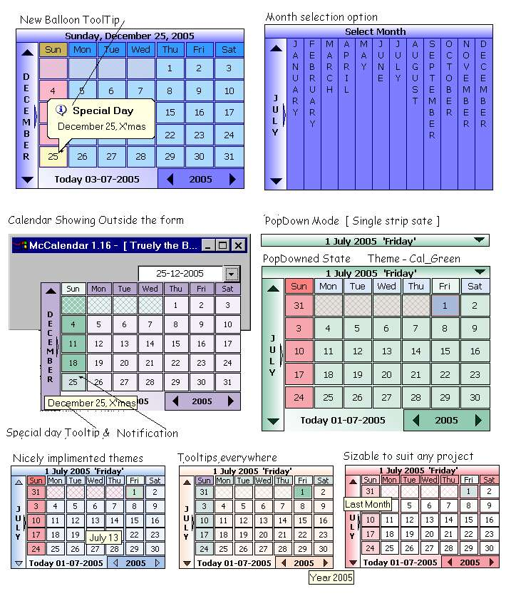



## McCalendar 1\.19 \-  \[ Upgraded Version for Advanced Owner\-drawn Calendar \]

### Description

Released version 1.19, with balloon tooltip (See screenshot) &gt; Features : Owner draw, List mode, PopUp mode, PopDown mode, Datepicker compatable, SpecialDay information (like national holydays), Auto regional settings with language detection, Custom tooltips, Month selection view, Unicode supported, Today button, User defined Calendar size, Fully cutomizable color options, Eight differnt color themes, Unique animation technique, Custom DateFormat, Custom FirstDayofWeek and more... The main factor which makes this control unique is , it is 'Owner-draw'. The dead-line version uses subclassing the parent form and calendar can show even out side the form. It has got "ListMode' and 'PopUpMode'. The calendar can show 'Special days' like national holydays special events (you can customize these for your native calendar). It supports all the languages even the unicode languages like chinese, Japenese...etc. The calendar is provided with full range of color options with eight different color themes. It has unique form animations which realy smooth and gives a pleasent appearance. The McCalendar can be used as a standard date picker by it's datepicker compatable procedures. All over this calendar is fully sizable and stylish. Thanks to all those coders who helped me in building this useful control with their comments, suggessions and code. Hope U all like it: Jim Jose :-))
 
### More Info
 

             |
---                |---
**Submitted On**   |2005-07-03 14:12:46
**By**             |[JJJJJJJJ](https://github.com/Planet-Source-Code/PSCIndex/blob/master/ByAuthor/jjjjjjjj.md)
**Level**          |Intermediate
**User Rating**    |4.9 (147 globes from 30 users)
**Compatibility**  |VB 6\.0
**Category**       |[Custom Controls/ Forms/  Menus](https://github.com/Planet-Source-Code/PSCIndex/blob/master/ByCategory/custom-controls-forms-menus__1-4.md)
**World**          |[Visual Basic](https://github.com/Planet-Source-Code/PSCIndex/blob/master/ByWorld/visual-basic.md)
**Archive File**   |[McCalendar190879742005\.zip](https://github.com/Planet-Source-Code/jjjjjjjj-mccalendar-1-19-upgraded-version-for-advanced-owner-drawn-calendar__1-61435/archive/master.zip)

